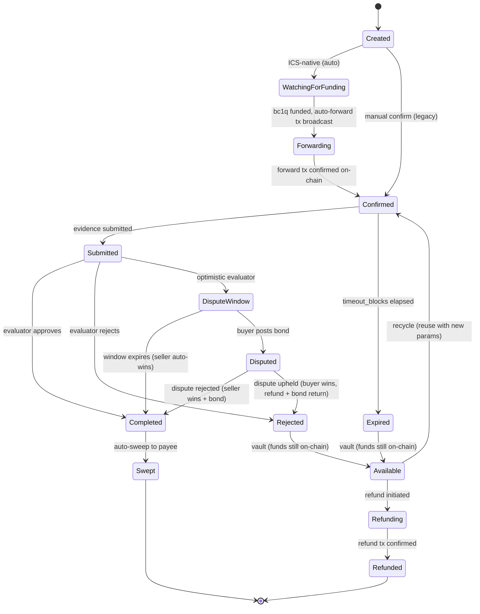

# Instrument Lifecycle

An instrument is a Bitcoin escrow. It moves through a state machine from creation to terminal state. This document describes every status and transition.

## State Machine

## Statuses

### Created

Initial state after `POST /v1/instrument/create`.

- Keys generated inside TEE
- P2TR escrow address derived
- Issuer key (kA) already zeroed
- For ICS-native instruments: bc1q funding address generated, auto-transitions to WatchingForFunding

### WatchingForFunding

ICS-native instruments waiting for the payer to send bitcoin to the bc1q funding address.

- Watcher polls for UTXOs at the bc1q address
- When funded: auto-builds P2WPKH→P2TR forward transaction
- Forward transaction broadcast to Bitcoin network

### Forwarding

Forward transaction has been broadcast but not yet confirmed on-chain.

- Watcher polls for confirmation at the bc1p (P2TR) address
- When confirmed: transitions to Confirmed

### Confirmed

Funding is on-chain at the P2TR escrow address. The instrument is active.

- Evidence can be submitted
- Timeout clock starts (if `timeout_blocks` configured)
- TDX attestation available at `GET /v1/attestation/:id`

### Submitted

Evidence has been submitted via `POST /v1/instrument/submit`.

- For `hash_match` evaluator: auto-evaluates inline, may immediately transition to Completed or Rejected
- For `human_approval` evaluator: waits for manual `POST /v1/instrument/complete` or `/reject`
- For `optimistic` evaluator: transitions to DisputeWindow

### DisputeWindow

Optimistic evaluator has accepted the evidence. A dispute window is open (default: 432 blocks, approximately 3 days).

- If the window expires without dispute: auto-transitions to Completed (seller wins)
- If the buyer disputes: transitions to Disputed

### Disputed

The buyer has posted a bond instrument (default: 10% of escrow amount) and filed a dispute.

- An evaluator or admin resolves the dispute
- `uphold`: buyer wins, escrow refunded to buyer, bond returned
- `reject`: seller wins, escrow swept to seller, bond swept to seller
- `refund`: seller voluntary refund, escrow refunded, bond returned
- Resolution timeout: if unresolved within the resolution window (default 1008 blocks, approximately 7 days), auto-completes (seller wins)

### Completed

Evaluator has approved the deliverable. Funds are released.

- Watcher auto-sweeps to the payee's destination address
- Taproot key-path spend from the P2TR escrow
- After sweep broadcast: transitions to Swept

### Rejected

Evaluator has rejected the deliverable.

- Instrument moves to Available (vault) if funds are still on-chain
- Creator can recycle or refund

### Expired

Timeout elapsed without evidence submission.

- Instrument moves to Available (vault)
- Creator can recycle or refund

### Available

Expired or rejected instruments whose funds are still on-chain at the P2TR address.

- **Recycle**: reset to Confirmed with new timeout and optional evaluator. No on-chain transaction. Same P2TR address.
- **Refund**: sweep funds back to the creator's original funding source address

### Refunding

Refund transaction has been broadcast but not yet confirmed.

### Refunded (terminal)

Refund transaction confirmed. Funds returned to creator. Keys zeroed. Instrument cannot be reused.

### Swept (terminal)

Sweep transaction confirmed. Funds delivered to payee. Keys zeroed. Instrument cannot be reused.

## Transitions Summary

| From | To | Trigger |
|------|-----|---------|
| Created | WatchingForFunding | ICS-native mode (automatic) |
| Created | Confirmed | Legacy manual confirm |
| WatchingForFunding | Forwarding | bc1q UTXO detected, forward tx broadcast |
| Forwarding | Confirmed | Forward tx confirmed on-chain |
| Confirmed | Submitted | `POST /v1/instrument/submit` with evidence |
| Confirmed | Expired | Timeout blocks elapsed |
| Submitted | Completed | Evaluator approves |
| Submitted | Rejected | Evaluator rejects |
| Submitted | DisputeWindow | Optimistic evaluator auto-transitions |
| DisputeWindow | Completed | Dispute window expires |
| DisputeWindow | Disputed | `POST /v1/instrument/dispute` with bond |
| Disputed | Completed | Dispute rejected (seller wins) |
| Disputed | Rejected | Dispute upheld (buyer wins) |
| Completed | Swept | Watcher auto-sweeps to destination |
| Expired | Available | Automatic vault |
| Rejected | Available | Automatic vault |
| Available | Confirmed | `POST /v1/instrument/:id/recycle` |
| Available | Refunding | `POST /v1/instrument/:id/refund` |
| Refunding | Refunded | Refund tx confirmed on-chain |

## Terminal States

Two states are terminal: **Swept** and **Refunded**. In both cases:
- All private keys (kB, kC, kF) are securely zeroed
- The instrument cannot transition to any other state
- The instrument is excluded from WAL persistence
